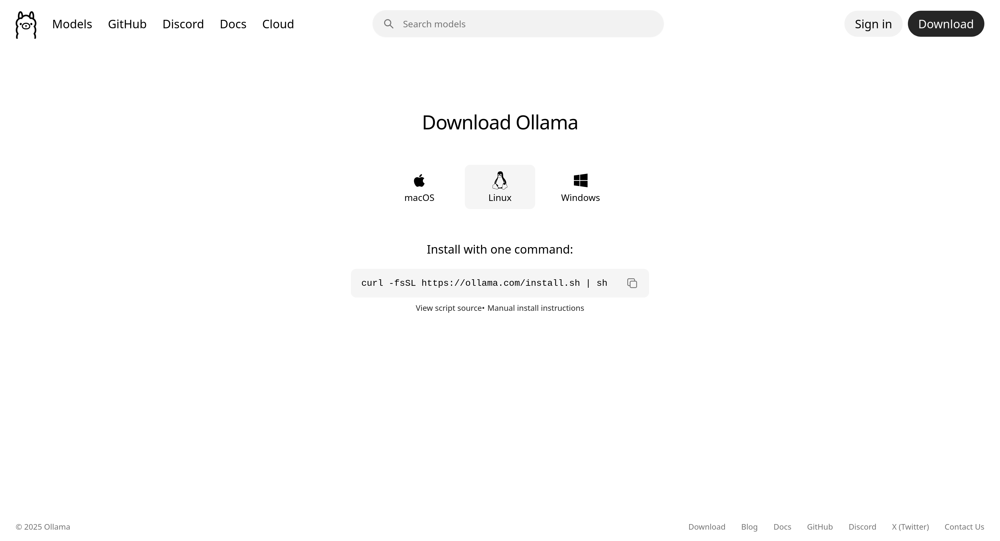

# Retrieval-Augmented Generation (RAG) Using LangChain

## Overview

This application is a full-featured **Agentic Retrieval-Augmented Generation (RAG)** system built using LangChain and LangGraph. It enables users to ingest documents into a vector database, perform semantic searches, and generate contextually relevant answers to queries by leveraging an intelligent agent that reasons about user queries and selects the appropriate tools.

The system features a **ReAct (Reasoning + Acting) Agent** that can:
- Query document collections via RAG pipeline
- Perform multi-collection similarity searches
- Search the web for real-time information (via Tavily)
- Dynamically discover available collections

The architecture uses **Ollama** for local LLM inference (DeepSeek-R1 for RAG, Ministral for agent reasoning), **ChromaDB** as the vector store, and provides both a **FastAPI** backend and a **Streamlit** frontend. For RAG evaluation, the application integrates with the **Cerebras API** using an LLM-as-a-judge approach.

## Features

### Agentic RAG (ReAct Framework)
- **Intelligent Agent**: ReAct-based agent that reasons about queries before selecting tools
- **Multi-Tool Support**: RAG query, similarity search, web search, and collection discovery
- **Multi-Collection Search**: Query across multiple document collections simultaneously
- **Conversation Memory**: Maintains context across multi-turn interactions
- **Web Search Integration**: Real-time information retrieval via Tavily API

### Core RAG Capabilities
- **Document Ingestion Pipeline**: Upload and process documents into a vector database with background task management
- **Semantic Search**: Perform intelligent searches across your document collection using vector embeddings
- **RAG Query Engine**: Get AI-generated answers grounded in your document context
- **Collection Management**: Create and manage multiple document collections

### Evaluation & Observability
- **Evaluation Metrics**: Assess RAG response quality using RAGAS metrics (Faithfulness, Answer Relevancy, Context Precision) with LLM-as-a-judge via Cerebras API
- **Batch Evaluation**: Evaluate multiple RAG responses simultaneously
- **LangFuse Integration**: Full observability and tracing for both RAG and agent interactions
- **Real-time Task Monitoring**: Track ingestion task status and progress

## Evaluation Metrics

1. **[Faithfulness](https://docs.ragas.io/en/stable/concepts/metrics/available_metrics/faithfulness/)**: Measures factual consistency between answer and context
2. **[Answer Relevancy](https://docs.ragas.io/en/stable/concepts/metrics/available_metrics/answer_relevance/)**: Measures how relevant the answer is to the question
3. **[Context Precision](https://docs.ragas.io/en/stable/concepts/metrics/available_metrics/context_precision/)**: Measures if relevant contexts are ranked higher

## How to Run
### Prerequites
- Ollama
- Python 3.13+
- Python virtual environment (recommended)
- LangFuse and Cerebras API Keys

### 1. Install Ollama

#### 1.1. Go to [Ollama](https://ollama.com/download/linux)



#### 1.2. Install Ollama

> Install ollama based on your system.

#### 1.3. Pull `deepseek-r1`, `ministral-3:8b (for tool calling)` and `qwen3-embedding` models

```bash
ollama pull deepseek-r1:8b
ollama pull ministral-3:8b
ollama pull qwen3-embedding:0.6b
```

#### 1.4. Run ollama server

```bash
ollama serve
```


### 2. Clone github repo

```bash
git clone https://github.com/afterSt0rm/rag-app.git
```

### 3. Create .env file

```bash
OLLAMA_BASE_URL=http://localhost:11434/
OLLAMA_LLM_MODEL=deepseek-r1
GOOGLE_API_KEY=your_api_key.........
EMBEDDING_MODEL=qwen3-embedding:0.6b
LLM_MODEL=gemini-2.5-flash
CHROMA_PERSIST_DIR=./vector_store/chroma_db
API_BASE_URL=http://localhost:8000
LANGFUSE_SECRET_KEY=your_api_key.........
LANGFUSE_PUBLIC_KEY=your_api_key.........
LANGFUSE_BASE_URL=https://cloud.langfuse.com
CEREBRAS_API_KEY=your_api_key.........
CEREBRAS_LLM_MODEL=gpt-oss-120b
TAVILY_API_KEY=your_api_key.........
OLLAMA_AGENT_LLM_MODEL=ministral-3
```

⚠️ Notes:

- Create a .env file in root directory after cloning the repository
- You need to create [Langfuse](https://cloud.langfuse.com/) account in order to create an API KEY
- You also need to create [Cerebras](https://cloud.cerebras.ai/) account and generate an API KEY
- You also need to create [Tavily](https://www.tavily.com/) account and generate an API KEY
- Make sure to paste the generated langfuse api key in `LANGFUSE_SECRET_KEY` and `LANGFUSE_PUBLIC_KEY` in .env
- Make sure to paste the generated cerebras api key in `CEREBRAS_API_KEY` in .env
- Make sure to paste the generated tavily api key in `TAVILY_API_KEY` in .env


### 4. Create a python virtual environment

```bash
python -m venv .venv
```

### 5. Activate virtual environment

#### 5.1. On Windows:

```bash
.venv\Scripts\activate 
```

#### 5.2. On Linux/macOS:

```bash
source .venv/bin/activate 
```

### 6. Install requirements

```bash
pip install -r requirements.txt
```

### 7. Run FastAPI

```bash
uvicorn api.main:app --reload
```

### 8. Run Streamlit UI

```bash
streamlit run frontend/streamlit_app.py
```
