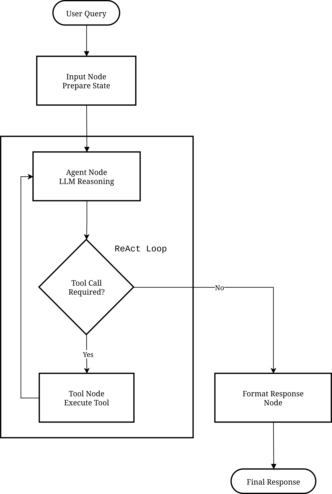

# Agentic RAG Implementation with ReAct Framework

This module implements an intelligent agent layer on top of the existing RAG system, using the **ReAct (Reasoning + Acting)** framework via LangGraph.

## Overview

The Agentic RAG system extends the existing RAG pipeline with an intelligent agent that can:

1. **Reason** about user queries to determine the best approach
2. **Route** queries to appropriate tools (RAG, Vector Search, Web Search)
3. **Act** by executing tools and synthesizing responses
4. **Learn** from tool outputs to provide better answers

### Key Features

- 🤖 **ReAct Framework**: Agent reasons before acting, enabling multi-step problem solving
- 🔧 **Multi-Tool Support**: RAG Query, Direct Vector Search, Web Search
- 📚 **Multi-Collection Search**: Query single or multiple document collections
- 🧠 **Conversation Memory**: Maintains context across interactions
- 📊 **LangFuse Integration**: Full observability and tracing
- 🚀 **FastAPI Integration**: RESTful API endpoints for agent interactions

---

## Architecture


### ReAct Agent workflow



### Decision Framework

The agent uses this framework to select tools:


## Tools

### 1. RAG Query via FastAPI (`query_rag_endpoint`)

**Purpose**: Full RAG pipeline with retrieval + LLM generation

**When to Use**:
- Complex questions requiring synthesized answers
- Questions needing citations and source tracking
- Single collection queries with comprehensive answers

**How It Works**:
```
Query → Agent Tool Call → /query endpoint → [Retrieve → Generate internally] → Complete Answer
```

**Agent Receives**: Complete answer (RAG handles generation)

---

### 2. Direct Similarity Search (`similarity_search_vectordb`)

**Purpose**: Direct vector database search with agent-controlled generation

**When to Use**:
- Multi-collection searches
- When agent needs control over response generation
- Comparing information across collections

**How It Works**:
```
Query → Agent Tool Call → [Embedding → Retrieve] → Documents → Agent Generates Answer
```

**Agent Receives**: Raw documents (agent controls generation)

**Key Advantage**: Agent can search multiple collections and synthesize results

---

### 3. Web Search (`web_search_tavily`)

**Purpose**: Real-time internet search via Tavily API

**When to Use**:
- Current events and news
- Real-time data (prices, weather, etc.)
- Information not in document collections
- External verification of facts

**How It Works**:
```
Query → Agent Tool Call → Tavily API → Web Results → Agent Synthesizes
```

---

### 4. List Collections (`list_available_collections`)

**Purpose**: Discover available document collections

**When to Use**:
- User asks what documents are available
- Agent needs to decide which collection(s) to search
- Metadata queries about the system

---

### Node Functions (`nodes.py`)

The `nodes.py` module provides factory functions for creating graph nodes:

```python
from agent.nodes import (
    create_input_node,
    create_agent_node,
    should_continue,
    format_response,
)

# Factory functions create nodes with injected dependencies
input_node = create_input_node(system_prompt=system_prompt)
agent_node = create_agent_node(
    llm_with_tools=llm_with_tools,
    max_reasoning_steps=config.max_reasoning_steps,
    debug_mode=config.debug_mode,
    log_tool_calls=config.log_tool_calls,
)
```

| Function | Purpose | Parameters |
|----------|---------|------------|
| `create_input_node()` | Creates input processing node | `system_prompt` |
| `create_agent_node()` | Creates LLM reasoning node | `llm_with_tools`, `max_reasoning_steps`, `debug_mode`, `log_tool_calls` |
| `should_continue()` | Routing function | `state` (used directly) |
| `format_response()` | Response formatting | `state` (used directly) |
| `error_node()` | Error handling | `state` |
| `extract_tool_results()` | Tool results extraction | `state` |

---

## Agent Router API Endpoints

### POST `/agent/query`

Query the ReAct agent with intelligent tool selection.

**Request Body**:
```json
{
  "query": "string (required)",
  "collection_names": ["string"] | null,
  "thread_id": "string (default: 'default')"
}
```

**Response**:
```json
{
  "query": "string",
  "response": "string",
  "reasoning_steps": "integer",
  "tool_used": "string | null",
  "sources": ["array"],
  "trace_id": "string | null"
}
```

### POST `/agent/query/sync`

Synchronous version of the agent query endpoint.

### POST `/agent/query/stream`

Stream the agent's response for real-time UI updates.

---
